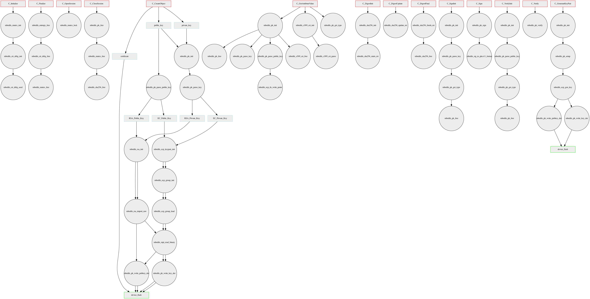
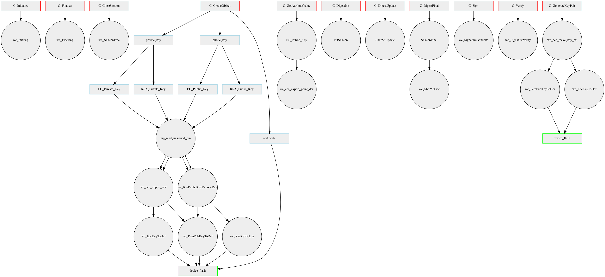

# FreeRTOS with mbedTLS to FreeRTOS with wolfSSL Migration Guide

mbed TLS is a TLS and crypto implementation currently used with FreeRTOS to establish connections to AWS Iot Core.
Documentation can be found on their [website](https://tls.mbed.org/) and currently FreeRTOS is tested with [mbedtls-2.16.8](https://github.com/ARMmbed/mbedtls/releases/tag/mbedtls-2.16.8). AWS IoT Core TLS requirements can be found in the AWS IoT Core [developer guide](https://docs.aws.amazon.com/iot/latest/developerguide/what-is-aws-iot.html). 

wolfSSL is a TLS and crypto implementation. Documentation can be found on their [website](https://www.wolfssl.com/) and the code we are using can be found on [Github](https://github.com/wolfSSL/wolfssl).
Currently there are examples of FreeRTOS with wolfSSL [v4.5.0-stable](https://github.com/wolfSSL/wolfssl/commit/0fa5af9929ce2ee99e8789996a3048f41a99830e) and FreeRTOS with wolfSSL-FIPS-Ready.

# wolfSSL porting guide
[wolfSSL porting guide](https://www.wolfssl.com/docs/porting-guide/). The wolfSSL library that would be used is the [wolfs-FIPS-Ready](https://github.com/FreeRTOS/FreeRTOS/tree/master/FreeRTOS-Plus/ThirdParty/WolfSSL-FIPS-Ready) library. Some of the example code provided uses code from projects using wolfSSL, but the FIPS ready version of the library can be plugged in instead.

## TLS
TLS is used to establish a connection to AWS IoT core. Clients MUST use TLS, although they have some options regarding authentication mentions, depending on what port they are connecting to. All AWS IoT Core endpoints require mutual authentication with the client. Therefore it is necessary for the client to carry a certificate and corresponding private key that have been shared with AWS IoT Core (Only the certificate is shared, the private key should be unique to the device and NEVER shared!).

### Necessary TLS library capabilities to establish a TLS connection to AWS IoT Core.
Both mbedtls and wolfSSL support the following capabilities needed to connect to AWS IoT Core.

* Mutual Authentication
* SNI (Server Name Indication)
    * This is used by AWS IoT Core to determine what endpoint the client is trying to connect to.
* ALPN (Application-Layer Protocol Negotiation)
    * Necessary if the client wants to use the same port for multiple protocols. The TLS layer will encrypt what protocol is being requested to prevent it leaking to MITM attacks.
* RSA Keys
* ECC Keys
* RSA Certificates
* ECDSA Certificates
* A set of Cipher suites intersecting with [AWS IoT Core](https://docs.aws.amazon.com/iot/latest/developerguide/transport-security.html).

## PKCS #11
### Necessary capabilities to create a PKCS implementation built upon wolfSSL
Note that the features needed are to align with the mbedtls based implementation. The chosen algorithms **can** be changed, but if so only stronger algorithms should be considered.

* Hashing
    * SHA256
* Verification
    * RSA Verify
    * ECC Verify
* Signing
    * RSA Sign
    * ECC Sign
* RNG
    * RNG requirements are deferred to the [FreeRTOS Qualification Guide](https://docs.aws.amazon.com/freertos/latest/qualificationguide/afq-checklist.html). Note that a TRNG is out of the scope of the library, but the RNG algorithm used should be a strong DRBG seeded by a TRNG provided by a port.
* Parsing EC and RSA keys
    * Read PEM and DER
* Writing EC and RSA keys to a buffer
    * Write PEM AND DER
* Parsing x509 Certs
    * Write PEM AND DER
* Writing x509 Certs to a buffer
    * Write PEM AND DER
* Generate an EC Key pair
    * Must set `WOLFSSL_KEY_GEN` in config for key generation.

### Using PKCS #11 to sign/verify TLS records
It is necessary for the TLS stack to allow the application to inject it's own signing and verifying, in order to work with PKCS #11. Below it will be outlined how this can be done with wolfSSL. The [using_mbedtls_pkcs11](https://github.com/FreeRTOS/FreeRTOS/tree/master/FreeRTOS-Plus/Source/Application-Protocols/network_transport/freertos_plus_tcp/using_mbedtls_pkcs11) is an existing example using PKCS #11 to sign and verify TLS records. There is a sample sign callback using mbedtls, privateKeySigningCallback, on line 694, in `using_mbedtls_pkcs11.c`.

The wolfSSL context can be modified with function pointers to callback into user defined sign and verify functions. Here we have an easy point to inject the sign/verify operations conducted by PKCS #11. wolfSSL splits these operations into a callback for RSA and ECC, as well as one for Sign and Verify.
The user needs to write and register these functions per wolfSSL context (`WOLFSSL_CTX`) with `wolfSSL_CTX_SetEccSignCb()`, `wolfSSL_CTX_SetEccVerifyCb()`, `wolfSSL_CTX_SetEccSharedSecretCb()`, `wolfSSL_CTX_SetRsaSignCb()`, `wolfSSL_CTX_SetRsaVerifyCb()`, `wolfSSL_CTX_SetRsaEncCb()`, and `wolfSSL_CTX_SetRsaDecCb()`.

In order to do this, `HAVE_PK_CALLBACKS` must be set in the config.

# Transport interface
FreeRTOS reference applications use a transport interface to glue together the TLS and TCP layers. Documentation for it can be found at [FreeRTOS.org](https://freertos.org/network-interface.html).

## Existing mbedtls and FreeRTOS Examples
1. [coreHTTP mutual authenticiation using mbedtls](https://github.com/FreeRTOS/FreeRTOS/tree/master/FreeRTOS-Plus/Demo/coreHTTP_Windows_Simulator/HTTP_Mutual_Auth).
1. [coreMQTT mutual authenticiation using mbedtls](https://github.com/FreeRTOS/FreeRTOS/tree/master/FreeRTOS-Plus/Demo/coreMQTT_Windows_Simulator/MQTT_Mutual_Auth).
1. [coreMQTT server authenticiation using mbedtls](https://github.com/FreeRTOS/FreeRTOS/tree/master/FreeRTOS-Plus/Demo/coreMQTT_Windows_Simulator/MQTT_Basic_TLS).
1. [Transport implementation with mbedtls](https://github.com/FreeRTOS/FreeRTOS/tree/master/FreeRTOS-Plus/Source/Application-Protocols/network_transport/freertos_plus_tcp/using_mbedtls).
1. [Transport implementation with mbedtls and PKCS #11](https://github.com/FreeRTOS/FreeRTOS/tree/master/FreeRTOS-Plus/Source/Application-Protocols/network_transport/freertos_plus_tcp/using_mbedtls_pkcs11).

## Existing wolfSSL and FreeRTOS Examples
Currently there are several demos that use wolfSSL with FreeRTOS.

1. [wolfSSL and FreeRTOS](https://github.com/FreeRTOS/FreeRTOS/tree/master/FreeRTOS-Plus/Demo/FreeRTOS_Plus_WolfSSL_Windows_Simulator)
1. [wolfSSL FIPS ready code and FreeRTOS](https://github.com/FreeRTOS/FreeRTOS/tree/master/FreeRTOS-Plus/Demo/FreeRTOS_Plus_WolfSSL_FIPS_Ready_Windows_Simulator)
1. [wolfSSL, FreeRTOS and coreMQTT](https://github.com/TakayukiMatsuo/FreeRTOS/tree/lts-development/FreeRTOS-Plus/Demo/FreeRTOS-IoT-Libraries-LTS-Beta2/mqtt/mqtt_mutual_auth_wolfSSL) - Please note that this demo is not released and is currently work in progress.
1. [Transport implementation with wolfSSL](https://github.com/TakayukiMatsuo/FreeRTOS/blob/lts-development/FreeRTOS-Plus/Source/FreeRTOS-IoT-Libraries-LTS-Beta2/c_sdk/platform/freertos/transport/src/wolfSSL_freertos.c) - Please note this implementation is not released and is currently work in progress.

## Example mbedtls macro configuration
A sample configuration used by AWS to connect to AWS IoT Core with [mbedtls](https://github.com/cobusve/SESIP_Demo/blob/master/source/aws_mbedtls_config.h).

## Example wolfSSL macro configuration
A sample configuration provided by WolfSSL to connect to AWS IoT Core with [wolfSSL](https://github.com/TakayukiMatsuo/FreeRTOS/blob/lts-development/FreeRTOS-Plus/Demo/FreeRTOS-IoT-Libraries-LTS-Beta2/mqtt/mqtt_mutual_auth_wolfSSL/user_settings.h).
Note that this configuration may not be equivalent to the one needed for creating a PKCS #11 implementation using wolfSSL.

# Implementing PKCS #11 with wolfSSL
## Existing mbedtls  example
Currently there is a reference implementation using mbedtls that can be found at the [corePKCS11](https://github.com/FreeRTOS/corePKCS11/blob/main/source/portable/mbedtls/core_pkcs11_mbedtls.c) repository.
The following diagram explains how mbedtls is used to implement some of the PKCS #11 interfaces. Please note that the chart excludes functions that do not call mbedtls functions. These functions can be directly copy and pasted to a wolfSSL implementation. Also note that a red outline indicates a PKCS #11 function, blue outlines are a cryptographic object type, and green is the PKCS #11 PAL used to abstract writing to a device's flash.

## Theoretical wolfSSL implementation
Currently there is no reference implementation using wolfSSL. The following diagram outlines how wolfSSl functions could be used to implement some of the PKCS #11 interface. Please note that the chart excludes functions that are unlikely to call wolfSSL functions. Also note that a red outline indicates a PKCS #11 function, blue outlines are a cryptographic object type, and green is the PKCS #11 PAL used to abstract writing to a device's flash.

## File location
Once completed, the wolfSSL based PKCS #11 implementation will exist at `https://github.com/FreeRTOS/corePKCS11/blob/main/source/portable/wolfSSL/core_pkcs11_wolfSSL.c`

## mbedTLS functions to wolfSSL functions translation table
Here is a table that could help an implementor migrate from mbedtls to wolfSSL.
Note that functions that are not critical are left out, for example logging functions, initialization functions, and platform functions (free / malloc).

| mbedtls function | wolfSSL function | Use case |
| --- | --- | --- |
| `mbedtls_sha256_starts_ret` | `InitSha256` | Initialize SHA-256 operation |
| `mbedtls_sha256_update_ret` | `Sha256Update` | Feed repeatedly feed data to hash |
| `mbedtls_sha256_finish_ret` | `Sha256Final` | Output SHA-256 hash result |
| `mbedtls_sha256_free` | `wc_Sha256Free` | Free the SHA-256 struct. |
| `mbedtls_ecp_point_read_binary` | `wc_ecc_import_point_der` | Import the byte array of an EC point into an EC object. |
| `mbedtls_ecp_tls_write_point` | `wc_ecc_export_point_der ` | Export an EC point object into a DER formatted array. |
| `mbedtls_x509_crt_init` | `wc_InitCert` | Initialize a certificate. Note that the wolfSSL and mbedtls don't really align here. |
| `mbedtls_x509_crt_parse` | `wolfSSL_CTX_use_certificate_buffer` | Load the root CA |
| `mbedtls_ecp_group_load` | `wc_ecc_import_raw` | Specify the EC curve to use. wolfSSL does this combined with importing the raw key bytes.. |
| `mbedtls_ctr_drbg_random` | `wc_RNG_GenerateBlock` | Outputs random bytes from a DRBG into a buffer.  |
| `mbedtls_ecp_gen_key` | `wc_ecc_make_key_ex` | Generate an EC keypair. |
| `mbedtls_ecdsa_verify` | `wc_ecc_verify_hash` | Verify a signature using an EC key. |
| `mbedtls_pk_get_type` | N/A | Parse key type |
| `mbedtls_pk_info_from_type` | N/A | Returns some data about PK type. Internal function for mbedtls used to modify sign and verify callback. |
| `mbedtls_pk_sign` | `wc_SignatureGenerate` | Abstraction over key type. Signs a buffer |
| `mbedtls_pk_parse_key` | `wolfSSL_CTX_use_PrivateKey_buffer` | Read a private key buffer into a useable context. |
| `mbedtls_pk_verify` | `wc_SignatureVerify` | Abstraction over the key type. Used to verify a signature. |
| `mbedtls_pk_write_key_der`  | `wc_EccKeyToDer` or `wc_RsaKeyToDer` | Write private key to DER format. |
| `mbedtls_pk_write_pubkey_der` | | `wc_PemPubKeyToDer`  | Write a private key to DER format. |
| `mbedtls_mpi_read_binary` | `mp_read_unsigned_bin` | Used to parse raw key data. Helper function for converting a PKCS #11 template to a crypto struct. |
| `mbedtls_ctr_drbg_seed` | `wc_InitRng` | Seed the DRBG with entropy. |
| `mbedtls_ctr_drbg_init` | `wc_InitRng` | Initialize DRBG. |
| `mbedtls_entropy_free` | `wc_FreeRng ` | Clean up DRBG. |
| `mbedtls_rsa_import_raw` | `wc_RsaPublicKeyDecodeRaw ` | Create a RSA key form the byte values of it's various parts. |
| `mbedtls_ssl_conf_alpn_protocol` | `wolfSSL_UseALPN` | Set the ALPN extension, used to specify what protocol the application would like to use. |
| `mbedtls_ssl_conf_rng` | No exact equivalent. RNG is configured by adding `GenerateSeed` function and `NO_DEV_RANDOM` to config, for devices that don't have `/dev/random` or `/dev/urandom` | Seed for the RNG used in the handshake. |
| `mbedtls_ssl_set_hostname` | `wolfSSL_CTX_UseSNI` | Set the underlying server the client wants to connect to.  AWS IoT endpoints host multiple servers. |
| `mbedtls_ssl_handshake` | `wolfSSL_connect` | Performs the TLS handshake that will connect the client to the server. |
| `mbedtls_ssl_conf_own_cert` | `wolfSSL_use_certificate` | Set the client certificate to present to the server. |
| `mbedtls_ssl_conf_ca_chain` | `wolfSSL_CTX_load_verify_buffer` | Set the root CA. |
| `mbedtls_ssl_close_notify` | `wolfSSL_shutdown ` | Send an alert to the server that the connection is going to close. |
| `mbedtls_ssl_set_bio` | `wolfSSL_SetIORecv` and `wolfSSL_SetIOSend` | Set the underlying socket functions for TLS layer to call. |
| `mbedtls_ssl_read` | `wolfSSL_read` | Read data over a socket using TLS |
| `mbedtls_ssl_write` | `wolfSSL_write ` | Write data over a socket using TLS. |
| `mbedtls_ssl_conf_authmode` | `wolfSSL_set_verify` | Set verification peer verification level. Should be set to `SSL_VERIFY_PEER`. Note that wolfSSL does this by default, so the call is not necessary. |
| `mbedtls_ssl_setup` | `wolfSSL_CTX_new` and `wolfSSL_new` | These calls will initialize the TLS objects. |
| N/A | `wolfTLSv1_2_client_method` | Set the TLS protocol version to v1.2 |
| `mbedtls_ssl_free` | `wolfSSL_free` | Free TLS resources.

## mbedtls header file to wolfSSL header file translation table
| mbedtls header | wolfSSL header | Use case |
| --- | --- | --- |
| `mbedtls/pk.h` | `wolfssl/wolfcrypt/rsa.h` | Needed for RSA operations. wolfSSL does not abstract to a PK context like mbedtls.|
| `mbedtls/pk_internal.h` | N/A | Was used to modify sign and verify callbacks. |
| `mbedtls/x509_crt.h` | `wolfssl/wolfcrypt/asn_public.h` | Used to parse and create certificates. |
| `mbedtls/ctr_drbg.h` | `wolfssl/wolfcrypt/random.h` | A DRBG based RNG. |
| `mbedtls/entropy.h` | `wolfssl/wolfcrypt/random.h` | API to seed the DRGG with entropy. |
| `mbedtls/sha256.h`| `wolfssl/wolfcrypt/sha.h` | SHA-256 is used to create a message digest. |
| `mbedtls/platform.h` | N/A | OS / stdlib abstraction layer. |
| `mbedtls/threading.h` | N/A | Threading abstractions eg. mutex. |
| `mbedtls/net.h` | `wolfssl/wolfio.h` | Socket configuration API . Used to setup underlying sockets used by wolfSSL. |

